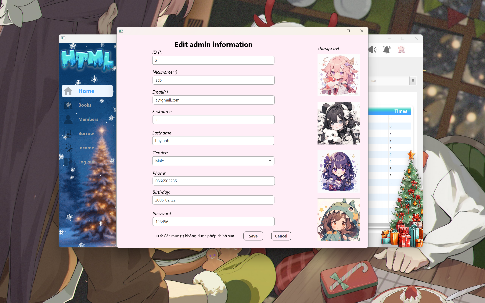

# Library Management System HTML

## Members of HTML:
- **Nguyễn Thị Phương 23021668**
- **Lê Huy Anh 23021464**
- **Nguyễn Đăng Đạo 23021516**

An interactive library management application built using Java, JavaFX, CSS and the Google Books API. This application allows users to search, view, and manage a collection of books efficiently.

## Features

- **Book Search**: Search books using keywords via the Google Books API.
- **Book Details**: View detailed information about selected books, including:
  - Title.
  - Author(s).
  - Description.
  - Preview link.
- **Library Management**:
  - Add books to the library collection.
  - Borrow books from the library.
  - Get physics books.
- **Interactive UI**: Built with JavaFX and FXML for a user-friendly interface.

## Technologies Used

- **Java**: Core logic and API integration.
- **JavaFX**: UI development and event handling.
- **CSS**:For customizing the appearance of JavaFX components.
- **Google Books API**: For fetching book data.
- **FXML**: For separating UI layout from Java code.

## System desgin and Databases for our Project
**System desgin**

**Databases**

## About our application

**LOGIN**: Sign In and Sign Up

**DASHBOARD**: OVERVIEW OUR APPLICATION: 
- MOST BORROWING BOOK, INCOME, BORROWTIMES
- 
- MUSIC SETTING
 
- NOTIFICATION.

- EDIT INFORMATION ADMIN, CHANGE AVATAR

**BOOK**: SEARCH BAR, ADD NEW BOOK INTO LIBRARY AND SEE PREVIEW BOOK IN OUR LIBRARY.
- List books:

- Search books:

- View preview book, add book into library, get QR's book.

**MEMBER**: VIEW MEMBER INFORMATION, NUMBER OF BOOKS BORROWED BY MEMBERS, EDIT MEMBERS.
- List of members, add and edit member.

- Show information about member when click on row, filter to search.

- Add new member and remove recently member.

- Edit recently member.

**BORROW**: SHOW INFOMATION ABOUT BOOK BEING BORROWED.
- List of borrowing, add new borrowing, filter.

- Add new borrowing and rule.

**INCOME**: SHOW INFOMATION ABOUT TRANSACTION.
- List of transaction, add new transaction, filter.

- Add new transaction.

**LOGOUT**: BACK TO LOGIN.

